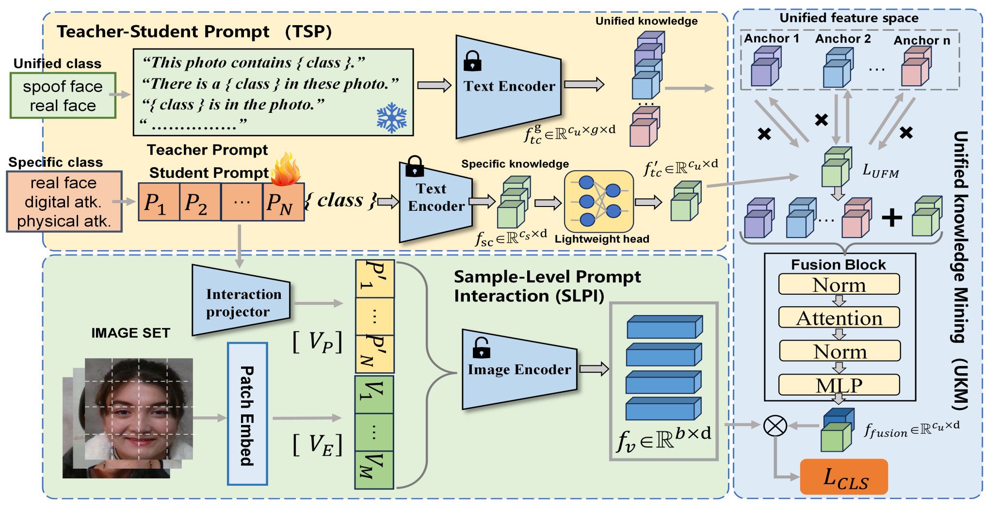
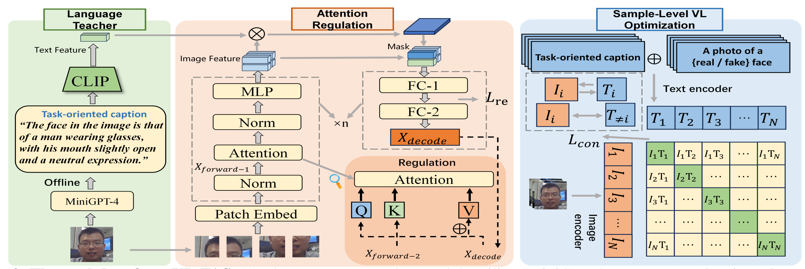
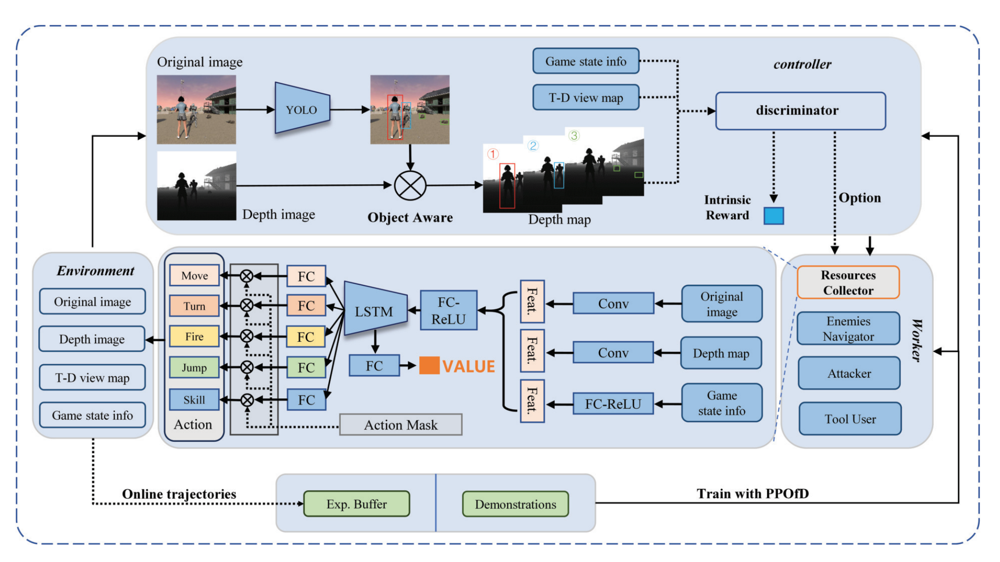








I am Hao Fang, a Master's graduate from the Institute of Automation, Chinese Academy of Sciences (CASIA), where I was supervised by [Prof. Wan Jun](https://scholar.google.com/citations?user=bSbc7FQAAAAJ&hl=zh-CN) (IEEE Fellow). and [Prof. Stan Z. Li](https://scholar.google.com/citations?user=Y-nyLGIAAAAJ&hl=zh-CN) (IEEE Fellow).

My research interests include computer vision and multimodal large language models. Previously, I served as a Multimodal LLM Engineer Intern at Alibaba's AMAP (Gaode Maps). Currently, I work as an Advertising LLM Engineer at Meituan.

For academic collaborations, please feel free to contact me via email.

# 🔥 News

- *2026*: &nbsp; UniAttack: Unified Physical-Digital Face Attack Detection, *International Journal of Computer Vision* (**IJCV,CCF-A**).
- *2026*: &nbsp; HySpeFAS: A Hyperspectral Face Anti-Spoofing Dataset Based on Snapshot Compressive Imaging, *IEEE Transactions on Information Forensics and Security* (**TIFS,CCF-A/SCI一区**).
- *2025*: &nbsp; UBG: An Unreal BattleGround Benchmark With Object-Aware Hierarchical Proximal Policy Optimization, *IEEE Transactions on Neural Networks and Learning Systems* (**TNNLS,SCI一区**).
- *2024*: &nbsp; Unified Physical-Digital Face Attack Detection (**IJCAI,CCF-A**).
- *2024*: &nbsp; VL-FAS: Domain Generalization via Vision-Language Model for Face Anti-Spoofing, *IEEE International Conference on Acoustics, Speech and Signal Processing* (**ICASSP,CCF-B,ORAL**).
- *2023*: &nbsp; Surveillance Face Anti-Spoofing, *IEEE Transactions on Information Forensics and Security* (**TIFS,CCF-A/SCI一区**).
- *2023*: &nbsp; Surveillance Face Presentation Attack Detection Challenge, *Proceedings of the IEEE/CVF Conference on Computer Vision and Pattern Recognition Workshops* (**CVPRW**).
- *2023*: &nbsp; Bandpass Filter Based Dual-Stream Network for Face Anti-Spoofing, *Proceedings of the IEEE/CVF Conference on Computer Vision and Pattern Recognition* (**CVPRW**).

# 📝 Publications

  

    

      
    

    
Unified physical-digital face attack detection

    
<strong>Hao Fang</strong>, A Liu, H Yuan, J Zheng, D Zeng, Y Liu, J Deng, S Escalerai

    
IJCAI 2024

    
Face Recognition (FR) systems can suffer from physical (i.e., print photo) and digital (i.e., DeepFake) attacks. However, previous related work rarely considers both situations at the same time. This implies the deployment of multiple models and thus more computational burden. The main reasons for this lack of an integrated model are caused by two factors: (1) The lack of a dataset including both physical and digital attacks with ID consistency which means the same ID covers the real face and all attack types; (2) Given the large intra-class variance between these two attacks, it is difficult to learn a compact feature space to detect both attacks simultaneously. To address these issues, we collect a Unified physical-digital Attack dataset, called UniAttackData. The dataset consists of  participations of 2 and 12 physical and digital attacks, respectively, resulting in a total of 29,706 videos. Then, we propose a Unified Attack Detection framework based on Vision-Language Models (VLMs), namely UniAttackDetection, which includes three main modules: the Teacher-Student Prompts (TSP) module, focused on acquiring unified and specific knowledge respectively; the Unified Knowledge Mining (UKM) module, designed to capture a comprehensive feature space; and the Sample-Level Prompt Interaction (SLPI) module, aimed at grasping sample-level semantics. These three modules seamlessly form a robust unified attack detection framework. Extensive experiments on UniAttackData and three other datasets demonstrate the superiority of our approach for unified face attack detection. 

    

      <a href='https://arxiv.org/abs/2401.17699'>Paper</a>
      <a href='https://arxiv.org/abs/2401.17699'>Code</a>
    

  

  

    

      
    

    
Vl-fas: Domain generalization via vision-language model for face anti-spoofing

    
<strong>Hao Fang</strong>, A Liu, N Jiang, Q Lu, G Zhao, J Wan

    
icassp oral 2024

    
Recent approaches have demonstrated the effectiveness of Vision Transformer (ViT) with attention mechanisms for domain generalization of Face Anti-Spoofing (FAS). However, current attention algorithms highlight all the salient objects (e.g., background objects, hair, glasses), which results in the feature learned by the model containing face-irrelevant noisy information. Inspired by existing Vision-language works, we propose the VL-FAS to extract more generalized and cleaner discriminative features. Specifically, we leverage fine-grained natural language descriptions of the face region to act as a task-oriented teacher, directing the model's attention towards the face region through top-down attention regulation. Furthermore, to enhance the domain generalization ability of the model, we propose a Sample-Level Vision-Text optimization module (SLVT). SLVT uses sample-level image-text pairs for contrastive learning, allowing the visual coder to comprehend the intrinsic semantics of each image sample, thereby reducing the dependence on domain information. Extensive experiments show that our approach significantly outperforms the state-of-the-art and improves the performance of the ViT by about twice.

    

      <a href='http://www.cbsr.ia.ac.cn/users/jwan/papers/ICASSP24.pdf'>Paper</a>
      <a href='http://www.cbsr.ia.ac.cn/users/jwan/papers/ICASSP24.pdf'>Code</a>
    

  

  

    

      
    

    
UBG: An Unreal BattleGround Benchmark With Object-Aware Hierarchical Proximal Policy Optimization

    
L Niu, B Li, X Fan,<strong>Hao Fang</strong>

    
TNNLS 2025

    
The deep reinforcement learning (DRL) has made significant progress in various simulation environments. However, applying DRL methods to real-world scenarios poses certain challenges due to limitations in visual fidelity, scene complexity, and task diversity within existing environments. To address limitations and explore the potential ability of DRL, we developed a 3-D open-world first-person shooter (FPS) game called Unreal BattleGround (UBG) using the unreal engine (UE). UBG provides a realistic 3-D environment with variable complexity, random scenes, diverse tasks, and multiple scene interaction methods. This benchmark involves far more complex state-action spaces than classic pseudo-3-D FPS games (e.g., ViZDoom), making it challenging for DRL to learn human-level decision sequences. Then, we propose the object-aware hierarchically proximal policy optimization (OaH-PPO) method in the UBG. It involves a two-level hierarchy, where the high-level controller is tasked with learning option control, and the low-level workers focus on mastering subtasks. To boost the learning of subtasks, we propose three modules: an object-aware module for extracting depth detection information from the environment, potentialbased intrinsic reward shaping for efficient exploration, and annealing imitation learning (IL) to guide the initialization. Experimental results have demonstrated the broad applicability of the UBG and the effectiveness of the OaH-PPO. We will release the code of the UBG and OaH-PPO after publication.

    

      <a href='https://ieeexplore.ieee.org/stamp/stamp.jsp?tp=&arnumber=11007665'>Paper</a>
      <a href='https://ieeexplore.ieee.org/stamp/stamp.jsp?tp=&arnumber=11007665'>Code</a>
    

  

# 🎖 Honors and Awards

- *2023.01 - CVRP小目标检测识别竞赛国际季军(3/180)
- *2023.06 - 中国科学院大学三好学生
- *2024.05 - 中国科学院院长奖候选人

# 💻 Working Experience

- *2024.07 - Present*, 大模型广告算法工程师, 美团.
- *2023.06 - 2024.03*, 多模态大模型算法工程师, 阿里巴巴 - 高德地图.
